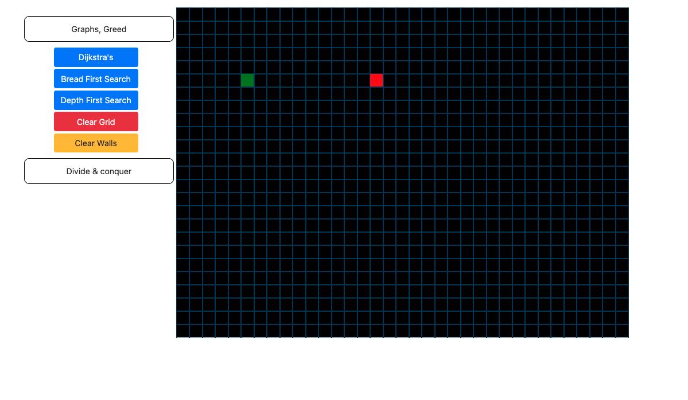
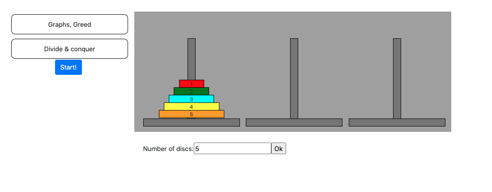
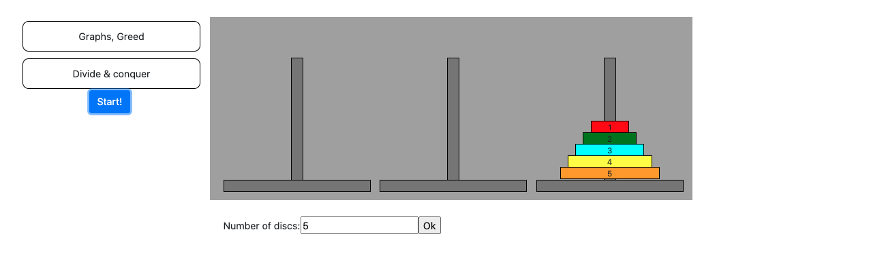
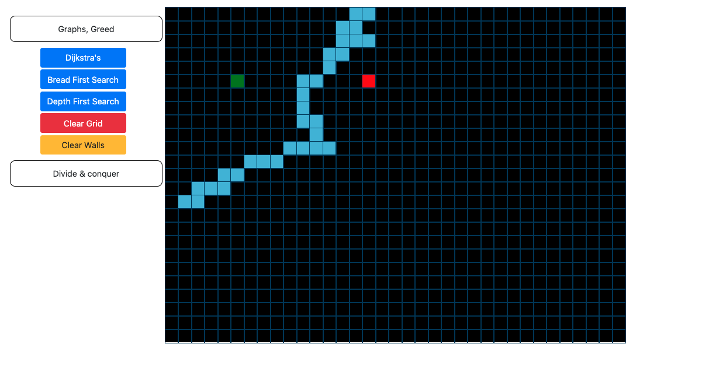

# Algorithm playground

**Número da Lista**: Final 
**Conteúdo da Disciplina**: Final 

## Alunos
|Matrícula | Aluno |
| -- | -- |
| 16/0119316 |  Ezequiel de Oliveira dos Reis |
| 16/0148375  |  Vitor Leal dos Santos |

## Sobre 
O projeto consiste na representação de alguns algoritmos de grafos, greedy, e D&C.

## Screenshots

## Instalação 
**Linguagem**: Javascript 
**Framework**: React 

Primeiramente devemos clonar o repositório:

    $ git clone https://github.com/projeto-de-algoritmos/Final_AlgorithmPlayground

Após clonar o repositório, é preciso acessar a pasta do projeto:

    $ cd Final_AlgorithmPlayground

Para rodar o projeto é necessário ter instalado o [yarn](https://classic.yarnpkg.com/pt-BR/docs/install/#debian-stable) na versão estável mais atual.

Após instalar o yarn, vamos instalar as dependências do projeto.

    Na pasta raiz, execute:

    $ yarn install

Depois, subir o servidor:

    $ yarn start

E então acessar no navegador:

    http://localhost:3000/

## Uso 
Ao selecionar uma aba, você será apresentado à uma lista de aplicações ou visualizações dos algoritmos, no caso dos agoritmos de grafos, é possivel criar uma parede entre os dois pontos destacados e visualizar o funcionamento do algoritmo, para isso basta pressionar o mouse acima das células desejadas. Já para a aba de D&C será mostrado uma aplicação da torre de hanói sendo resolvida automaticamente, sendo possivel apenas alterar a quantidade de discos desejados.
